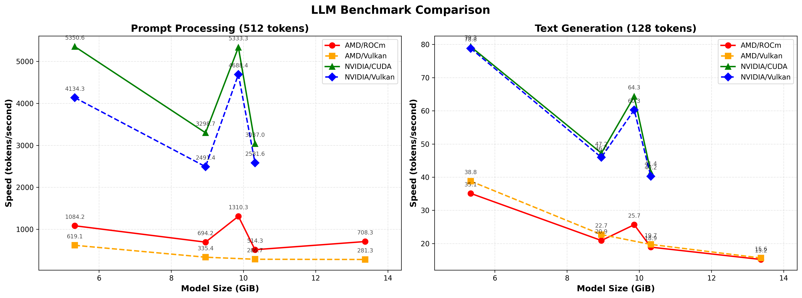

## Context

Benchmark done using llama.cpp

    ./run-llamacpp.sh -m ~/models/Llama-3-8B-Instruct.Q5_K_M.gguf --benchmark -b rocm

Hardware:

 - Framework Desktop AMD AI 395+
 - eGPU Razer CoreX + NVidia 4070Ti

</ing>

## AMD AI 395+ / Strix Halo

**Rocm:**
    Device 0: Radeon 8060S Graphics, gfx1151 (0x1151), VMM: no, Wave Size: 32

**Vulkan:**
    ggml_vulkan: 0 = Radeon 8060S Graphics (RADV GFX1151) (radv) | uma: 1 | fp16: 1 | bf16: 0 | warp size: 64 | shared memory: 65536 | int dot: 1 | matrix cores: KHR_coopmat

| model                          |       size |     params | backend    | ngl |            test |                  t/s |
| ------------------------------ | ---------: | ---------: | ---------- | --: | --------------: | -------------------: |
| llama 8B Q5_K - Medium         |   5.33 GiB |     8.03 B | ROCm       | 999 |           pp512 |       1084.19 ± 2.41 |
| llama 8B Q5_K - Medium         |   5.33 GiB |     8.03 B | Vulkan     | 999 |           pp512 |        619.09 ± 1.82 |
| llama 8B Q5_K - Medium         |   5.33 GiB |     8.03 B | ROCm       | 999 |           tg128 |         35.11 ± 0.05 |
| llama 8B Q5_K - Medium         |   5.33 GiB |     8.03 B | Vulkan     | 999 |           tg128 |         38.80 ± 0.07 |
| mistral3 14B Q5_K - Medium     |   8.95 GiB |    13.51 B | ROCm       | 999 |           pp512 |        694.17 ± 1.05 |
| mistral3 14B Q5_K - Medium     |   8.95 GiB |    13.51 B | Vulkan     | 999 |           pp512 |        335.40 ± 0.95 |
| mistral3 14B Q5_K - Medium     |   8.95 GiB |    13.51 B | ROCm       | 999 |           tg128 |         20.91 ± 0.01 |
| mistral3 14B Q5_K - Medium     |   8.95 GiB |    13.51 B | Vulkan     | 999 |           tg128 |         22.70 ± 0.04 |
| gemma3n E4B Q8_0               |   9.86 GiB |     6.87 B | ROCm       | 999 |           pp512 |       1310.28 ± 3.32 |
| gemma3n E4B Q8_0               |   9.86 GiB |     6.87 B | Vulkan     | 999 |           pp512 |                  N/A |
| gemma3n E4B Q8_0               |   9.86 GiB |     6.87 B | ROCm       | 999 |           tg128 |         25.66 ± 0.02 |
| gemma3n E4B Q8_0               |   9.86 GiB |     6.87 B | Vulkan     | 999 |           tg128 |                  N/A |
| mistral3 14B Q6_K              |  10.32 GiB |    13.51 B | ROCm       | 999 |           pp512 |        514.28 ± 0.56 |
| mistral3 14B Q6_K              |  10.32 GiB |    13.51 B | Vulkan     | 999 |           pp512 |        286.73 ± 0.63 |
| mistral3 14B Q6_K              |  10.32 GiB |    13.51 B | ROCm       | 999 |           tg128 |         18.91 ± 0.05 |
| mistral3 14B Q6_K              |  10.32 GiB |    13.51 B | Vulkan     | 999 |           tg128 |         19.73 ± 0.03 |
| mistral3 14B Q8_0              |  13.37 GiB |    13.51 B | ROCm       | 999 |           pp512 |        708.34 ± 0.89 |
| mistral3 14B Q8_0              |  13.37 GiB |    13.51 B | Vulkan     | 999 |           pp512 |        281.26 ± 0.56 |
| mistral3 14B Q8_0              |  13.37 GiB |    13.51 B | ROCm       | 999 |           tg128 |         15.19 ± 0.01 |
| mistral3 14B Q8_0              |  13.37 GiB |    13.51 B | Vulkan     | 999 |           tg128 |         15.64 ± 0.04 |

## NVidia 4070Ti

**CUDA:**
    Device 0: NVIDIA GeForce RTX 4070 Ti, compute capability 8.9, VMM: yes

**Vulkan:**

    ggml_vulkan: 0 = NVIDIA GeForce RTX 4070 Ti (NVIDIA) | uma: 0 | fp16: 1 | bf16: 1 | warp size: 32 | shared memory: 49152 | int dot: 1 | matrix cores: NV_coopmat2
    ggml_vulkan: 1 = Radeon 8060S Graphics (RADV GFX1151) (radv) | uma: 1 | fp16: 1 | bf16: 0 | warp size: 64 | shared memory: 65536 | int dot: 1 | matrix cores: KHR_coopmat

| model                          |       size |     params | backend    | ngl |            test |                  t/s |
| ------------------------------ | ---------: | ---------: | ---------- | --: | --------------: | -------------------: |
| llama 8B Q5_K - Medium         |   5.33 GiB |     8.03 B | CUDA       |  99 |           pp512 |       5350.57 ± 6.94 |
| llama 8B Q5_K - Medium         |   5.33 GiB |     8.03 B | Vulkan     | 999 |           pp512 |      4134.34 ± 83.79 |
| llama 8B Q5_K - Medium         |   5.33 GiB |     8.03 B | CUDA       |  99 |           tg128 |         79.34 ± 0.01 |
| llama 8B Q5_K - Medium         |   5.33 GiB |     8.03 B | Vulkan     | 999 |           tg128 |         78.82 ± 0.33 |
| mistral3 14B Q5_K - Medium     |   8.95 GiB |    13.51 B | CUDA       |  99 |           pp512 |       3298.67 ± 5.61 |
| mistral3 14B Q5_K - Medium     |   8.95 GiB |    13.51 B | Vulkan     | 999 |           pp512 |      2491.44 ± 12.13 |
| mistral3 14B Q5_K - Medium     |   8.95 GiB |    13.51 B | CUDA       |  99 |           tg128 |         47.24 ± 0.00 |
| mistral3 14B Q5_K - Medium     |   8.95 GiB |    13.51 B | Vulkan     | 999 |           tg128 |         45.96 ± 0.29 |
| gemma3n E4B Q8_0               |   9.86 GiB |     6.87 B | CUDA       |  99 |           pp512 |       5333.26 ± 2.49 |
| gemma3n E4B Q8_0               |   9.86 GiB |     6.87 B | Vulkan     | 999 |           pp512 |     4688.36 ± 100.02 |
| gemma3n E4B Q8_0               |   9.86 GiB |     6.87 B | CUDA       |  99 |           tg128 |         64.32 ± 0.02 |
| gemma3n E4B Q8_0               |   9.86 GiB |     6.87 B | Vulkan     | 999 |           tg128 |         60.26 ± 0.27 |
| mistral3 14B Q6_K              |  10.32 GiB |    13.51 B | CUDA       |  99 |           pp512 |       3037.02 ± 3.11 |
| mistral3 14B Q6_K              |  10.32 GiB |    13.51 B | Vulkan     | 999 |           pp512 |      2581.60 ± 13.32 |
| mistral3 14B Q6_K              |  10.32 GiB |    13.51 B | CUDA       |  99 |           tg128 |         41.40 ± 0.02 |
| mistral3 14B Q6_K              |  10.32 GiB |    13.51 B | Vulkan     | 999 |           tg128 |         40.23 ± 0.16 |
| mistral3 14B Q8_0              |  13.37 GiB |    13.51 B | CUDA       |  99 |           pp512 |                  N/A |
| mistral3 14B Q8_0              |  13.37 GiB |    13.51 B | Vulkan     | 999 |           pp512 |                  N/A |
| mistral3 14B Q8_0              |  13.37 GiB |    13.51 B | CUDA       |  99 |           tg128 |                  N/A |
| mistral3 14B Q8_0              |  13.37 GiB |    13.51 B | Vulkan     | 999 |           tg128 |                  N/A |

