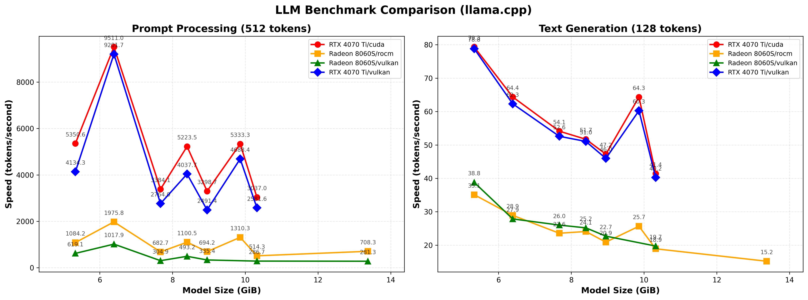
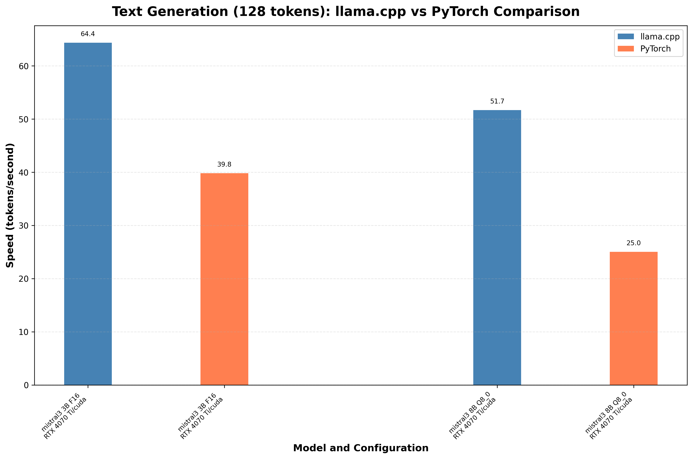
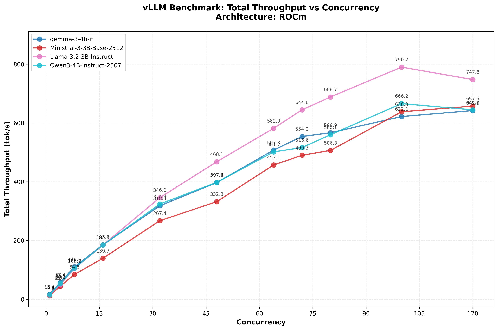
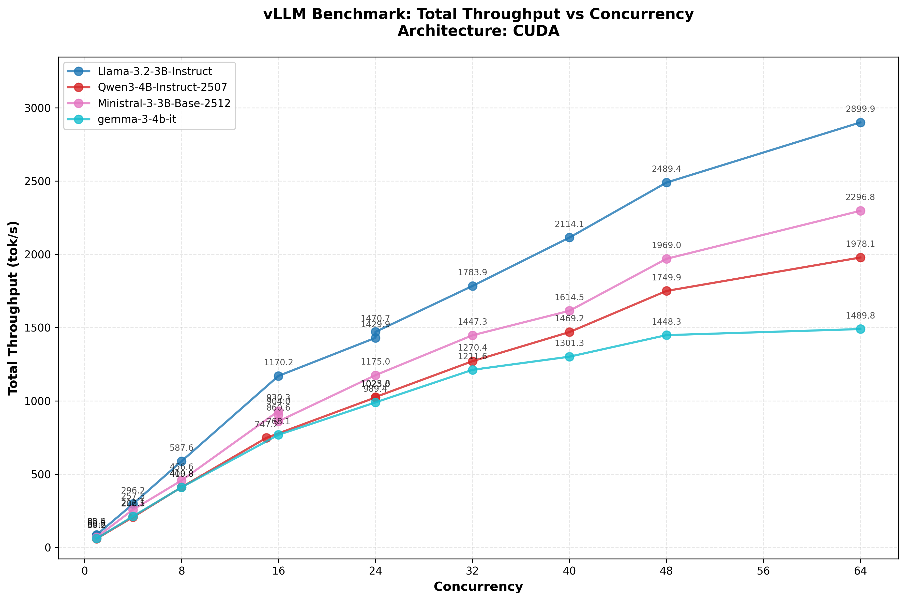
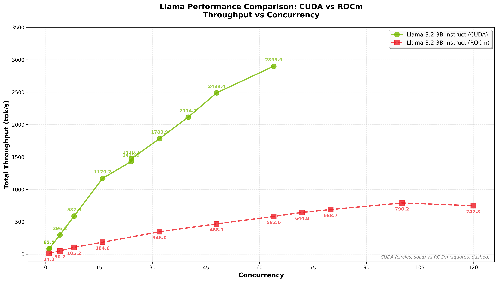
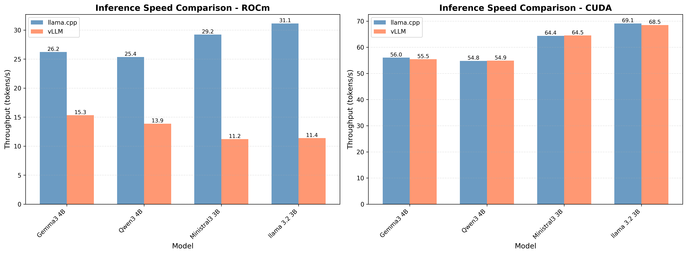

# Local Inference
## llama.cpp inference

### Driver/Backend comparison with llama.cpp

</ing>

## llama.cpp vs pytorch

</ing>

## vllm inference

### Batch Inference

Use `vllm bench serve` to create a token generation throughput benchmark for different level of concurrency.

# Comparing llama.cpp and vllm

## Models 

| Model name      | GGUF file name                       | Hugging Face name                  |
| --------------- | ------------------------------------ | ---------------------------------- |
| gemma3 4B F16   | gemma-3-4b-it.fp16.gguf              | google/gemma-3-4b-it               |
| qwen3 4B F16    | Qwen3-4B-Instruct-2507-F16.gguf      | Qwen/Qwen3-4B-Instruct-2507        |
| mistral3 3B F16 | Ministral-3-3B-Base-2512.f16.gguf    | mistralai/Ministral-3-3B-Base-2512 |
| llama 3B F16    | llama-Llama-3.2-3B-Instruct-F16.gguf | meta-llama/Llama-3.2-3B-Instruct   |

## Results

## Model Selection

### Issues with Quantization

Support for pre-quantized models in vllm seems limited :

 - does not work on ROCm?
 - works on Cuda but only on some GPUs (Hooper) (to be checked)

As a result, trying to load quantized models at least on ROCm fails.
The error message does not provide useful information.

     RuntimeError: Engine core initialization failed. See root cause above. Failed core proc(s): {}

NB: There no root cause above

Typically, models that exist only as FP8 can not being able to loaded at least on ROCm 
    - mistralai/Ministral-3-3B-Instruct-2512
    - mistralai/Ministral-3-8B-Instruct-2512

### Other loading issues

Some other models (like microsoft/Phi-3.5-mini-instruct) can not be loaded by vllm even if they are in BF16 (may be driver / ROCm issue)

    Memory access fault by GPU node-1 (Agent handle: 0x26326510) on address 0x7f51acdff000. Reason: Page not present or supervisor privilege.

Long story short: I was not able to load some models and decided that I needed to pick my battles.

### Models that are too big without Quantization

With 12GB of VRAM on the nVidia, without quantization, in BF16, I can not load a model with more that ~5B parameters.

Meaning a lot of models will not load on the NVidia card with 12GB:

  - mistralai/Mistral-Small-Instruct-2409 is too big 22B
  - mistralai/Mistral-Nemo-Instruct-2407 is too big 12B
  - meta-llama/Llama-3.2-8B-Instruct

## Does it makes sense to compare

vLLM and llama.cpp are design with different goals:

 - llama.cpp is about running local workload using C++
 - vllm is about doing proper batching to maximize GPU thoughput

So, on paper using vllm (python) with a betch size of 1 against llama.cpp is probably no 100% fair.

One thing to look for:

 - vLLM: Uses Flash Attention by default (if supported by your GPU).
 - llama.cpp: Does not seem to use Flash Attention by default 

May need to test with and without Flash Attention ?

