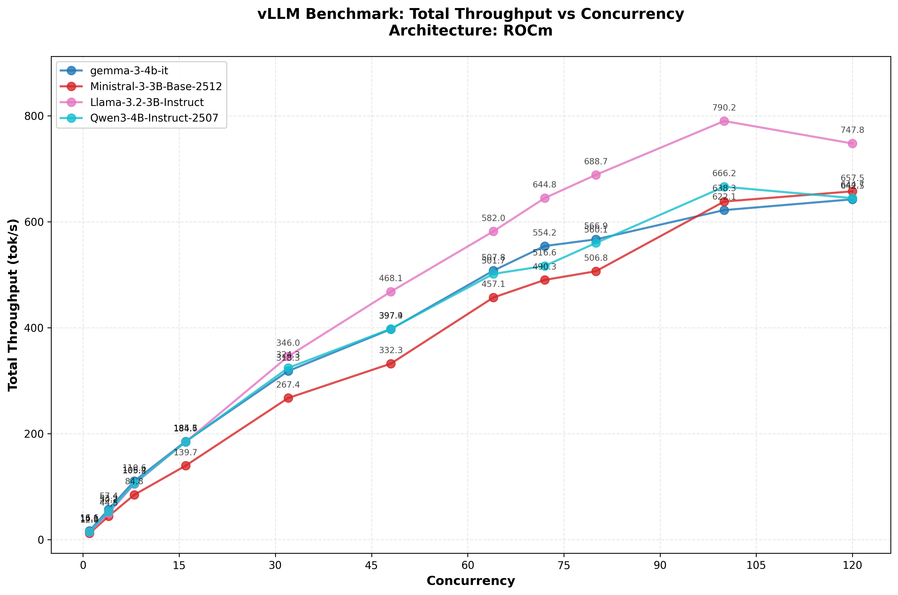

## vllm engine

Using Docker image of vllm so that I can easily switch between Cuda and ROCm : seems simpler with Docker.

Bsed on documentation, I will assume:

| Container | Hardware / GPU | OpenAI API? | Chat | Vision/Audio |
| --- | --- | --- | --- | --- |
| `vllm/vllm-openai` | **NVIDIA GPU** (CUDA) | Y | Y | No (Text/Images only) |
| `vllm/vllm-tpu` | **Google TPU** (v4/v5e) | Y | Y | No (Text/Images only) |
| `vllm/vllm-omni` | **NVIDIA GPU** (CUDA) | Y | Y | Audio & Video |
| `vllm/vllm-omni-rocm` | **AMD GPU** (ROCm) | Y | Y | Audio & Video |

### Model used for tests

  - `google/gemma-3-4b-it`
  - `mistralai/Ministral-3-3B-Base-2512` (base model is in BF16)
  - `meta-llama/Llama-3.2-3B-Instruct`
  - `Qwen/Qwen3-4B-Instruct-2507`

## Batch Inference

Use `vllm bench serve` to generate a token generation throughput benchmark for different level of concurrency.

## Setup 

### NVida Setup

Fror Nvidia need to install kernels extensions

    sudo pacman -S nvidia-container-toolkit

Comfigure Docker

    sudo nvidia-ctk runtime configure --runtime=docker

    sudo systemctl restart docker

Test access

    docker run --rm --gpus all nvidia/cuda:12.4.1-base-ubuntu22.04 nvidia-smi

### Rocm Setup

No system level extensions (but does not work)

Run test container

    docker run -it   --device /dev/kfd   --device /dev/dri   --group-add video   --ipc=host   --cap-add=SYS_PTRACE   --security-opt seccomp=unconfined   -e HSA_OVERRIDE_GFX_VERSION=11.0.0   rocm/dev-ubuntu-22.04   bash

From within container:

> root@90fdf6d8647c:/# amd-smi

    +------------------------------------------------------------------------------+
    | AMD-SMI 26.2.0+021c61fc      amdgpu version: Linuxver ROCm version: 7.1.1    |
    | VBIOS version: 00107962                                                      |
    | Platform: Linux Baremetal                                                    |
    |-------------------------------------+----------------------------------------|
    | BDF                        GPU-Name | Mem-Uti   Temp   UEC       Power-Usage |
    | GPU  HIP-ID  OAM-ID  Partition-Mode | GFX-Uti    Fan               Mem-Usage |
    |=====================================+========================================|
    | 0000:c2:00.0                 0x1586 | N/A        N/A   0             N/A/0 W |
    |   0       0     N/A             N/A | N/A        N/A           1013/65536 MB |
    +-------------------------------------+----------------------------------------+
    +------------------------------------------------------------------------------+
    | Processes:                                                                   |
    |  GPU        PID  Process Name          GTT_MEM  VRAM_MEM  MEM_USAGE     CU % |
    |==============================================================================|
    |  No running processes found                                                  |
    +------------------------------------------------------------------------------+

> root@90fdf6d8647c:/# rocm-smi

    WARNING: AMD GPU device(s) is/are in a low-power state. Check power control/runtime_status

    ======================================== ROCm System Management Interface ========================================
    ================================================== Concise Info ==================================================
    Device  Node  IDs              Temp    Power     Partitions          SCLK  MCLK  Fan  Perf  PwrCap  VRAM%  GPU%  
                  (DID,     GUID)  (Edge)  (Socket)  (Mem, Compute, ID)                                              
    ==================================================================================================================
    0       1     0x1586,   43175  49.0°C  10.029W   N/A, N/A, 0         N/A   N/A   0%   auto  N/A     1%     1%    
    ==================================================================================================================
    ============================================== End of ROCm SMI Log ===============================================

## Model Selection

### Issues with Quantization

Support for pre-quantized models in vllm seems limited :

 - does not work on ROCm?
 - works on Cuda but only on some GPUs (Hooper) (to be checked)

As a result, trying to load quantized models at least on ROCm fails.
The error message does not provide useful information.

     RuntimeError: Engine core initialization failed. See root cause above. Failed core proc(s): {}

NB: There no root cause above

Typically, models that exist only as FP8 can not being able to loaded at least on ROCm 
    - mistralai/Ministral-3-3B-Instruct-2512
    - mistralai/Ministral-3-8B-Instruct-2512

### Other loading issues

Some other models (like microsoft/Phi-3.5-mini-instruct) can not be loaded even if they are in BF16
(may be driver / ROCm issue)

    Memory access fault by GPU node-1 (Agent handle: 0x26326510) on address 0x7f51acdff000. Reason: Page not present or supervisor privilege.

### Models that are too big without Quantization

With 12GB of VRAM on the nVidia, without quantization, in BF16, I can not load a model with more that ~5B parameters.

Meaning a lot of models will not load on the NVidia card with 12GB:

  - mistralai/Mistral-Small-Instruct-2409 is too big 22B
  - mistralai/Mistral-Nemo-Instruct-2407 is too big 12B
  - meta-llama/Llama-3.2-8B-Instruct

